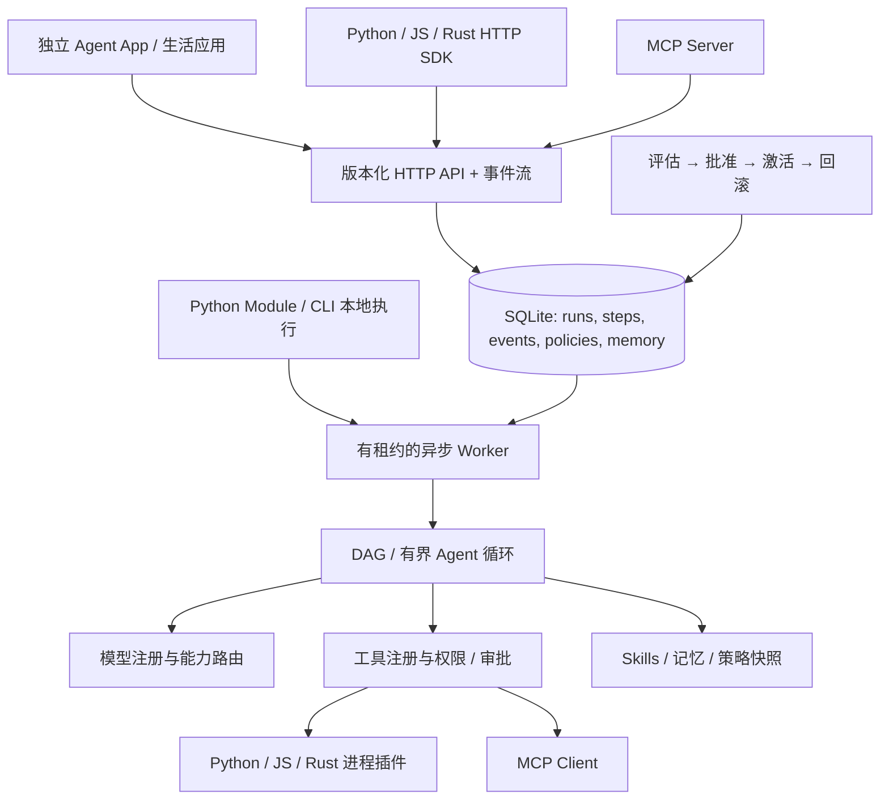

# 架构

完整开发入口：[中文开发指南](DEVELOPER_GUIDE.zh-CN.md) / [English developer guide](DEVELOPER_GUIDE.en.md)。下文描述核心设计；目标控制和移动核心的后续实现见 [GOALS.md](GOALS.md) 与 [MOBILE_RUNTIME_STRATEGY.md](MOBILE_RUNTIME_STRATEGY.md)。

## 先理解三个边界

节点是一个独立执行单元，内部可以组合多段普通代码，对外只有一次调用和一组输入输出。工作流用依赖关系连接节点；子工作流则保留一张独立步骤图，在父运行下创建子运行。不是所有复用能力都需要包装成子工作流。

Python 的 `@node` / `@tool` 编译成一个 tool Step；`Agent` 编译成一个 agent Step。`Sequential` / `Module.forward` 展开到同一张图；显式 `Subflow(module)` 或 `Subflow("saved.id")` 编译成 subworkflow Step。节点内的普通操作整体重试；需要逐步恢复的操作应拆成流程。

能力库将单步模板保存为 `NodeDefinition`，完整图保存为 `Workflow`；来源类型决定实例化行为。SDK 和 CLI 不依赖 App；App 通过 HTTP 调用后端。新手从[搜索到生图案例](GETTING_STARTED.zh-CN.md)开始，维护者继续阅读下面的执行细节。

## 组件关系

## 为什么选择 Python 内核

生态、可读性和扩展速度优先。HTTP 与 JSON Schema 是跨语言契约，不要求嵌入 CPython，也不在各语言重写调度器。Rust SDK 和插件是实际可运行的原生进程；有计算热点时可独立迁移到 Rust。Python async 处理 I/O；阻塞或不可信业务应放进插件进程。

## 多输入与非线性构图

SDK 的通用入口是 `Module.forward`；`Sequential` 只是单值串联的便利容器。流程参数形成 `$input`，每次节点调用返回符号引用，引用产生边；一个结果可被多个节点使用，一个节点可依赖多个结果。`Artifact` 保存分支产物，返回字典可同时暴露多个输出。[搜索到生图案例](GETTING_STARTED.zh-CN.md)演示实际的分叉、汇合与多个外部输入。

`Call` 和子流程输入可引用上一步的整个对象，执行时先解析再检查对象类型；普通标量不会被误当作参数字典。`Module.forward` 仍是静态构图接口：运行时条件通过底层 `Step.when` 表达，不能把 Python 原生控制流当作已实现的动态编排。

## 执行语义

Workflow 是不可变 DAG；Step 支持 tool、model、agent、transform、retrieve、artifact、foreach、subworkflow、approval、input。参数中的 `{"$ref":"step_id.path"}` 指向已完成的祖先步骤输出；`$input` 指向流程初始输入。独立节点可并发；依赖失败会阻止后续节点。延迟步骤通过 `not_before` 时间戳调度，不占用等待线程。

运行状态：queued、running、waiting_approval、waiting_input、needs_attention、succeeded、failed、cancelled。步骤另可为 waiting_children、retrying、skipped。SQLite 事务原子领取任务；每次领取有唯一 owner，提交、checkpoint、心跳都检查 owner，阻止旧 worker 回写。活跃 worker 周期延长租约；进程死亡后由新 worker 重新领取。

foreach 为每个元素创建持久化子运行；父步骤等待时让出 worker，避免嵌套耗尽执行槽位。子任务的预算逐级计入祖先运行；取消向下传播、审批与补充信息向上聚合。每层最多 100 个循环元素、最多嵌套 8 层，并受 child_runs 和 wall_time 限制。

工具调用先写入 invocation，再执行，再提交结果。已成功 invocation 可复用。幂等工具可在崩溃后重试；非幂等写工具如果只有开始记录而没有结果，则进入 needs_attention。这里提供的是持久化恢复和可核验的副作用语义，不承诺跨任意外部系统的 exactly-once。

## Agent 范式

- 确定性链、路由、并行/汇总：DAG 节点及依赖。
- ReAct / tool-use：有界 Agent 循环；工具请求结构化，模型只看到 allowlist。
- Plan-and-execute：decision 模型返回结构化动作计划，逐个执行并观察结果，再决定调整计划或结束；写操作仍逐调用确认，不直接执行生成代码。
- 多角色协作：多个 agent 节点交换结构化产物；本版本不实现开放式自治 swarm。
- RAG / memory：文档分块、按来源更新版本、词法/向量/混合检索；SQLite 存储本地向量，线性检索适合小型知识库。记忆有来源、过期和删除；checkpoint 仅用于同一运行恢复。
- Evaluator/optimizer：离线评估候选策略，批准后用于新 run；保留可回滚版本。
- Human-in-the-loop：写操作审批、结构化补充信息、结果不确定时核验、生活事项完成证据。审批/输入答复均有状态比较，防止重复恢复。

## 输入、输出和运行治理

Scheduler 持久化单次/间隔计划及 webhook；错过的间隔合并为一次，不补发全部历史任务。触发创建的也是普通 Workflow。知识和记忆注入上下文时保留来源并标为外部资料；长对话只删除完整历史工具组，保留原始指令与任务，超出上限明确失败。

模型调用前预留调用数、输出额度和已知价格的费用；不明确的用量有单独标记，不能当作零费用。临时供应商错误可使用显式备用模型，权限/schema 错误不会降级绕过。产物独立保存并带哈希；trace 汇总事件、调用、用量、子任务和产物。

这些是单机可靠执行机制，不是生产高可用结论。没有跨主机队列、leader 选举、分布式事务或多租户隔离。

## 扩展点

`ModelProvider` 定义统一异步模型请求；`ToolRegistry` 注册 Python handler 或进程/MCP handler；`SkillRegistry` 负责发现与按需加载；HTTP v1 是跨语言公共接口。存储实现集中在 Store，便于之后迁移 PostgreSQL，但 0.1 不声称提供已验证的其他后端。

平台和应用分离：框架不依赖搬家领域；example 通过注册工具、调用 Hub.submit、使用独立业务表与 API 扩展运行。跨应用部署应使用独立数据库和 token，当前不具备租户安全隔离。

## 移动端架构演进（设计，待实现）

当前 Python Hub 定位为桌面/服务器执行器。Android/iOS 增加可嵌入 Rust Core 与 Kotlin/Swift 平台桥：时间、存储、网络、凭证、通知和后台生命周期从核心抽象出去。已有 Rust SDK 仅是 HTTP 客户端。工作流、节点、版本、预算、事件和回执契约共享，执行能力按运行器声明路由。

Docker 不进入后续方案。端侧基线使用签名内置能力与声明式流程，JS/WASM 扩展按平台规则与实际隔离能力验证；完整 Python/Node 及长期任务可使用用户显式配置的电脑/服务器执行器。当前尚无跨设备所有权转移协议或手机原生宿主。依据和研发顺序见 [Android/iOS 策略](MOBILE_RUNTIME_STRATEGY.md)。

## 组件库与协议目录

NodeLibrary 在已有版本化定义之上保存 ComponentManifest，实例化仍生成标准 Step。ComponentPackage 导出固定 API、单步节点模板和子流程的传递依赖，导入先检查 SHA-256、闭包和实际效果，再在事务内写入版本；凭证别名绑定单独存储，不进入不可变包。代码包目前仅定义候选元数据。

ModelCatalog 从模型 ID、端点声明与公开协议快照映射文字适配器或原生 HTTPTool。HTTPTool 支持 JSON/form/multipart、产物上传和媒体结果封装。异步 GET 轮询通过 WaitingRemote 和持久 checkpoint 释放 worker；状态未知、失败或超预算均显式失败，外部写调用继续沿用审批与不确定结果恢复。

跨平台能力匹配只选择候选位置，不代表存在 Rust Core 或手机 Host。详细交付边界见 [节点库](NODE_LIBRARY.md)、[模型接口](MODEL_API_COMPATIBILITY.md)、[组件包](COMPONENT_PACKAGES.md)。

## 安装边界

本地 Python SDK/CLI、可选 HTTP 服务、独立 App 使用同一工作流和运行器。前端资源迁至 `apps/agent/`，`serve` 不提供静态页面；基础安装无需 Web 依赖。见 [SDK 指南](SDK_GUIDE.zh-CN.md)和[拆分设计](SDK_AND_APP.md)。
