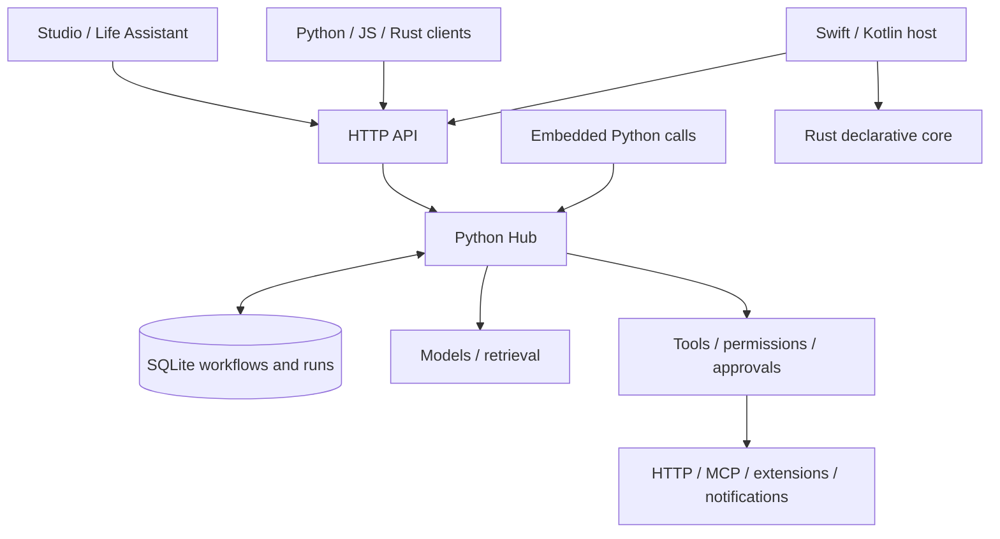

# EasyAgent Developer Guide

[中文](DEVELOPER_GUIDE.zh-CN.md) · **English** · [Project overview](../README.en.md) · [User guide](USER_GUIDE.en.md) · [Documentation index](README.en.md)

Baseline: 0.1.0 / September 20, 2026. For SDK integration, node/extension development, platform adapters, and framework maintenance. Run commands from the repository root. These are development-preview interfaces; 0.x does not promise ABI stability across versions.

## Start here

Read [keyword research to image generation](GETTING_STARTED.en.md), covering multiple inputs, branches and joins, then the [local SDK and CLI guide](SDK_GUIDE.en.md). This document is a reference for framework and extension development. The full toolchain below is needed for framework integration tests, not for using the SDK.

A **node** is one operation whose implementation can combine ordinary code. A **workflow** connects nodes. A **subworkflow** retains its own graph and child run. `Module` organizes graph construction; `Subflow` explicitly creates the child boundary.

## Contents

- [Development environment](#development-environment)
- [Source map and architecture](#source-map-and-architecture)
- [Execution and recovery semantics](#execution-and-recovery-semantics)
- [Workflow and API contracts](#workflow-and-api-contracts)
- [Python, JavaScript, and Rust](#python-javascript-and-rust)
- [Integrate models, search, and custom APIs](#integrate-models-search-and-custom-apis)
- [Build complete extensions](#build-complete-extensions)
- [Develop Skills and connect MCP](#develop-skills-and-connect-mcp)
- [Runtime development, repair, and learning](#runtime-development-repair-and-learning)
- [Build applications and Studio features](#build-applications-and-studio-features)
- [Permissions, credentials, and operations](#permissions-credentials-and-operations)
- [Integration tests and debugging](#integration-tests-and-debugging)
- [Packaging and platforms](#packaging-and-platforms)
- [Maintain documentation and changes](#maintain-documentation-and-changes)

## Development environment

Use Python 3.11+ (3.12 recommended) and uv. Full development/integration also needs Node.js 20+, Rust/Cargo, and Chromium. Install native build tools if a platform wheel is unavailable. There is no Node frontend build step.

```sh
uv sync --locked --extra app --extra dev --python 3.12
uv run --extra app playwright install chromium
uv run --extra app easyagent studio --port 8770 --database .eah/development.db
```

Use a separate database and available port. Client examples accept `EAH_URL=http://127.0.0.1:8770`; CLI submissions, extension installs, and Skill commands use their own `--url`. Set `EAH_TOKEN` when authentication is required; do not commit its value.

Python dependencies are in [pyproject.toml](../pyproject.toml) and `uv.lock`; Rust dependencies use each crate's Cargo.lock. SDKs are used from this repository rather than assuming registry publication.

The Python server package and command are `easyagent`; the standalone client is `easyagent-client` (import `easyagent_client`). Other package names are JavaScript `@easyagent/client`, and Rust `easyagent-client` / `easyagent-core`. The Python runtime, local SDK and model catalog live in `src/easyagent/`; frontend assets and proxy live in `apps/agent/src/easyagent_app/` with `easyagent_app.*` imports. The backend provides `easyagent.*` imports; no former package, command alias, or import interception hook is installed.

Workflow, component, extension, and backup formats use `easyagent.*.v1`. The native Rust library is `easyagent_core`; Android/iOS application identifiers are `ai.easyagent.mobile`. Packages using former format identifiers are rejected. Existing packages require offline migration with recomputed digests; signed packages must be signed again by their publisher, never edited while retaining the old signature.

The desktop data directory is `EasyAgent`, with no lookup or fallback to another product's directory. Source installations still use the `.eah` data directory and `EAH_*` configuration variables; these configuration conventions do not provide aliases for other Python package names. Use `--database` or `EAH_DATA_DIR` to choose your data location. The workspace folder name does not determine Python imports.

## Source map and architecture

- `src/easyagent/contracts.py`: strict Pydantic contracts and graph/schema validation. `store.py`: SQLite transactions and durable records.
- `runtime.py`, `tools.py`: scheduling, execution, tool calls, approvals, and recovery. `goals.py`: output verification and plan revisions. `scheduling.py`: triggers.
- `models.py`, `model_streaming.py`: model registry, protocols, and streaming deltas. `http_tools.py`, `openapi_tools.py`, `search.py`: declarative APIs and search.
- `extensions.py`, `extension_contracts.py`, `extension_process.py`: packages, contributions, and processes. `backends.py`: service replacement. `plugins.py`: legacy process plugins.
- `skills.py`, `skill_packages.py`, `mcp_bridge.py`, `mcp_manager.py`: skill resources and MCP. `sessions.py`, `delegation.py`: conversations and child agents.
- `development.py`, `code_development.py`, `evolution.py`, `learning.py`: runtime definitions, code candidates, policy evaluation, and learning.
- `connections.py`, `system_notifications.py`, `gateway.py`, `voice.py`: credentials, messaging, notifications, and voice. `operations.py`: diagnostics/backups.
- `api.py`, `studio.py`: REST and Studio APIs. `apps/agent/`: independent browser ES modules and proxy. `sdk/python/`, `sdk/javascript/`, `sdk/rust/`: standalone language clients. `client.py` and `extension_sdk.py` expose the standalone SDK interfaces through the `easyagent` package.
- `core/`: embedded Rust state machine. `platforms/`: desktop and Swift/Kotlin hosts. `examples/life_assistant/`: domain application. `tests/integration/`: integration acceptance.



The Python Hub is the full execution engine. The Rust SDK is an HTTP client; Rust core is an embedded execution subset. Keep these roles distinct and avoid duplicating business scheduling in every SDK.

## Local SDK, CLI and independent App

The [SDK and CLI guide](SDK_GUIDE.en.md) covers executable examples, exit codes, approvals, recovery and shorter three-language calls.

`modules.py` compiles `@node` / `@tool`, `Agent`, `Module.forward`, `Sequential`, `Call` and `Subflow` into existing Workflow contracts. `local.py` manages synchronous/asynchronous sessions using the same Hub. Local sessions claim only their own runs and descendants; service mode manages workspace-wide schedules and maintenance.

`easyagent serve` provides backend APIs only. `easyagent-app --backend URL` is an independent browser application and fixed-backend same-origin proxy; it never imports the runtime. Desktop and `studio` launchers explicitly combine the packages. The backend retains authoring APIs in `studio.py`, without HTML/CSS assets.

Base installs exclude FastAPI, Uvicorn, MCP, browsers and JS/WASM engines. Select extras `server`, `mcp`, `code`, `browser` or `documents`, or use `app` for the application environment. Verify isolated wheels with `python scripts/check_distributions.py dist`.

## Execution and recovery semantics

Submission validates the graph, permissions, and capabilities, freezes model/tool/subworkflow/extension dependencies, and creates a durable run. Workers claim ready steps transactionally, using unique owners, leases, heartbeats, and fencing. Expired workers cannot overwrite a new owner's result.

Run states include `queued/running/waiting_approval/waiting_input/needs_attention/succeeded/failed/cancelled`. Internal steps can also wait for children, retry, or skip. SDK `wait` returns at completion or when human action is needed; callers must check `status`.

Tool invocations are persisted before side effects. Successful receipts can be reused; recovery retries require actual idempotency support. A non-idempotent write without a receipt needs reconciliation. Exactly-once behavior across arbitrary providers is not promised. Approval is tied to specific arguments; changed arguments/plans do not inherit permission for another operation.

`foreach` and subworkflows create durable child runs and release the worker while waiting. Calls, tokens, child counts, time, and cost limits accumulate to the root budget. Cancellation propagates but cannot reverse accepted remote actions. Compensation is explicitly configured, not transactional rollback.

Workflow versions remain fixed. Online repair creates another child execution and workflow revision instead of mutating a running DAG in place. Workflow success, goal acceptance, notification submission, and external delivery are distinct facts.

## Workflow and API contracts

### Minimal workflow

This definition needs no model, network, or key. Save it as JSON and submit it with `easyagent run`:

```json
{
  "name": "hello",
  "inputs": {"message": "Hello"},
  "steps": [
    {"id": "echo", "target": "core.echo", "input": {"message": {"$ref": "$input.message"}}},
    {"id": "save", "kind": "artifact", "depends_on": ["echo"],
     "input": {"name": "hello.json", "media_type": "application/json", "content": {"$ref": "echo"}}}
  ]
}
```

`Workflow` has `name/steps/inputs/metadata/limits`. Step IDs are unique, dependencies must exist, and cycles are rejected. `{"$ref":"step.path"}` references a declared ancestor; `$input` references initial input. A JSON Schema's own `$ref` is not interpreted as a data edge. Canvas positions live in `metadata.editor`.

Common step types:

- `tool`: call a registered tool. `target` names it; `input` must satisfy its schema.
- `model`: call a model alias/capability. `agent`: bounded `react` or `plan_execute` within an allowlist.
- `transform`: restructure JSON constants/references without arbitrary scripts. `retrieve`: retrieve with citations. `artifact`: save downloadable output.
- `foreach`: `input.items` plus `body`; child flows receive `$input.item` and `$input.index`. `subworkflow`: input mapping and pinned workflow references.
- `approval` / `input`: explicit approval or structured human input. `goal`: goal-controller entry point, not something ordinary repair plans may nest.

Steps can set `max_attempts`, `timeout_seconds`, `not_before`, `requires_approval`, `when`, and `compensate`. `workflow_ref={id,revision}` references a saved version. Omitting a revision resolves/pins it during preparation rather than following later updates. See the [Workflow schema](contracts/workflow.schema.json).

### REST and schemas

A running instance's `/openapi.json` defines endpoints/input structures; `/docs` provides interactive reference. Core paths:

- `POST /v1/runs`: submit. `GET /v1/runs/{id}`: inspect. `POST /v1/runs/{id}/cancel`: cancel.
- `GET /v1/runs/{id}/events?after=N`: incremental events. `/stream`: SSE; retain the cursor when reconnecting.
- `POST /v1/approvals/{id}`: `{approved}`. `POST /v1/inputs/{id}`: an object matching the pending input schema.
- `POST /v1/reconciliations/{id}`: `{output,receipt}` for an uncertain write.
- `/v1/tools`, `/v1/models`, `/v1/skills`: catalogs. `/v1/studio/workflows`: saved definitions.

Submission accepts `Idempotency-Key`; the same key with a different definition conflicts. Public contracts reject unknown fields. Errors contain `detail`: 401/403 concern authentication/authorization, 404 missing resources, 409 revision/state conflicts, and 422 validation. Do not retry every error indiscriminately.

After public contract changes, run:

```sh
uv run python scripts/export_contracts.py
```

This updates `docs/contracts/*.schema.json` and `sdk/javascript/contracts.d.ts`. Maintain SDK method declarations, Python client methods, and Rust serde types separately as needed. Generated schemas do not replace runtime cross-field checks, permission checks, or provider-specific business validation.

## Python, JavaScript, and Rust

For saved workflows, prefer `client.workflow(id).start(inputs, key=...)` and the returned handle's `result()`. JavaScript uses `{key}` and Rust uses `Some(key)`. `from_env` / `fromEnv` reads `EAH_URL` and `EAH_TOKEN`. Use `upload_file` / `uploadFile` for attachments and `result.download(name, path)` for named artifacts or video URLs. The [three-language image/video examples](../examples/getting_started/media/README.en.md) cover one-time configuration, approval/resume, and composite workflows.

Public `PUT/GET /v1/workflows/{id}` manages definitions. `POST /v1/workflows/{id}/runs` accepts `WorkflowCall` (`inputs`, optional `revision`) and `Idempotency-Key`. `GET /v1/runs/{id}/result` returns status, `outputs`, artifacts including child runs, approvals, and errors. Inputs follow `metadata.input_schema`; declare output references in `metadata.outputs` and optionally validate them with `metadata.output_schema`. Subworkflows keep both raw `results` and a stable named `outputs` array.

The first submission persists a fixed revision before execution. The same key and request resumes across processes/languages, including after workflow edits. Reusing a key with different inputs or revision returns 409. `result()` raises `RunStopped` with the run ID and state for approval, input, reconciliation, failure, or cancellation. A local wait timeout does not cancel the server run. Use existing `approve`, `respond`, or Studio, then resume that same task. Existing `submit`/`wait` and generic `request` remain available.

### Python HTTP and embedding

The runnable [python_client.py](../examples/getting_started/python_client.py) uses `async with HubClient(url, token)`, then `submit` and `wait`. For suspended runs, use `approve`, `respond`, or generic `request`, then wait on the same run ID.

The standalone client and extension SDK are Apache-2.0 components in [sdk/python](../sdk/python/README.md). Import them with `from easyagent_client import HubClient` and `from easyagent_client.extension_sdk import Extension`. Running `uv sync` at the repository root installs this workspace member. To install only the SDK, run from the repository root:

```sh
python -m pip install ./sdk/python
```

This package depends only on `httpx` and does not install or import the server. Server users can also access the same standalone SDK through `easyagent.client` and `easyagent.extension_sdk`. Embedding the Python Hub still involves the server's AGPL license; see [license scopes](../LICENSING.md).

Embedded example: [embedded_tool.py](../examples/getting_started/embedded_tool.py).

```sh
uv run python examples/getting_started/embedded_tool.py
```

It creates an independent Hub, registers async `math.add` with input/output schemas, starts workers, submits a flow, checks `{"value":5}`, and stops the Hub in `finally`. Handlers use `async handler(arguments, context)`; external systems can deduplicate using `context.invocation_id`.

Use asynchronous I/O. Put blocking or untrusted work in an appropriate extension runtime. Re-register Python handlers on process restart: durable runs do not automatically serialize arbitrary in-memory functions.

### JavaScript / TypeScript

The [JavaScript example](../examples/getting_started/javascript_client.mjs) imports `HubClient` from `sdk/javascript/index.js` with no npm installation. Node.js 20+ supplies the required runtime capabilities. Types come from `index.d.ts` and generated `contracts.d.ts`.

Methods include `submit/wait/approve/respond`, extension/Skill/component/workflow methods, and generic `request`. Browser UI uses same-origin fetch and does not expose Hub tokens to models or extension iframes.

### Rust

```sh
cargo run --locked --manifest-path sdk/rust/Cargo.toml --example demo
```

[demo.rs](../sdk/rust/examples/demo.rs) covers `HubClient`, `serde_json::Value`, typed `Workflow`, and input suspension/resumption. `submit_typed` preserves subworkflow and tool-version fields; `submit`/`request` allow access to new endpoints. The crate is `easyagent-client`, imported in code as `easyagent_client`.

For a native tool process, see [plugin.rs](../sdk/rust/examples/plugin.rs). That process protocol, the Rust HTTP SDK, and mobile Rust core occupy different layers.

## Integrate models, search, and custom APIs

### Configuration and providers

Copy/edit the [configuration template](../examples/getting_started/config.example.json), replace its endpoint/model ID, and supply `MY_MODEL_KEY` through your environment:

```sh
uv run --extra app easyagent studio --port 8770 --database .eah/configured.db --config examples/getting_started/config.example.json
```

The placeholder endpoint is not callable. Avoid registering a configuration alias already persisted as a model connection in the same database. Dialects are `chat/responses/anthropic`; declare actual `capabilities`. Deployment owns fallback selection and price configuration.

The generic launcher does not create a connection merely because `OPENAI_API_KEY` exists. It reads references in `--config` or restores saved Settings connections. `OPENAI_BASE_URL/OPENAI_API_KEY/TYPESAFE_API_KEY/TINYFISH_API_KEY` are used by specific live demos; inspect their `--help` and source for requirements.

Custom providers implement `async generate(request: ModelRequest, model: str) -> ModelResult`, registered through `hub.models.register(alias, provider, model_id, capabilities, ...)`. Return appropriate text/data/tool_calls/images/embeddings and actual usage. `decision` is a structured-decision capability, not a required model identity. Standard text streaming is handled by `model_streaming.py`; an interrupted stream without its ending marker is not a complete result.

Native image/audio/video protocols can use catalog HTTP nodes instead of being forced into text generation. Separate submission and status polling. `Polling` declares pending/succeeded/failed values, interval, count, and deadline. Expand media references only on outbound requests rather than embedding large base64 payloads in workflows. The catalog is a protocol snapshot, not a list of live-tested models.

### HTTPTool and search

Prefer a declarative `HTTPTool` for existing HTTP APIs. Register through `POST /v1/studio/apis` or Python `register_http_tool`. Persistent management supports pinned versions and `expected_revision`. Credentials use vault aliases or environment references.

Start the synthetic local service:

```sh
uv run --extra app python -m examples.demos.api_fixture
```

It exposes `/lookup` on port 8771. Configure this definition in **Add search / API**, or save it through the API:

```json
{
  "name": "demo.lookup",
  "description": "Look up synthetic local material",
  "method": "POST",
  "url": "http://127.0.0.1:8771/lookup",
  "effect": "read",
  "input_schema": {
    "type": "object", "properties": {"query": {"type": "string"}},
    "required": ["query"], "additionalProperties": false
  }
}
```

This local POST is explicitly read-only. Real external mutations must declare `effect="write"`; do not promise idempotency by default. Set `idempotent=true` only when the operation actually deduplicates a stable invocation identity.

Map parameters to path/query/header/cookie/body, or use `body_parameter` for an entire body. JSON/form/multipart requests and JSON/text/artifact/media responses are supported. Multipart files reference Hub artifact IDs, not arbitrary host paths. Remote URLs require HTTPS; loopback may use HTTP. Ordinary responses are limited to 1 MB and media channels to 10 MB. Ordinary incoming HTTP bodies have a 2 MB limit; only the raw `/v1/artifacts/upload` endpoint accepts up to 50 MB.

OpenAPI import supports a subset: common parameters, JSON/form bodies, nonrecursive local references, and single authentication schemes. It does not cover all documents, multipart operations, or streams. Use manual definitions, native catalog operations, MCP, or extensions for other protocols.

TinyFish has dedicated validation and settings: `GET/POST /v1/studio/search/tinyfish`, and `POST /v1/studio/search/tinyfish/test`. Keys are encrypted; saved settings take precedence over startup configuration with the same name. Python can use `register_tinyfish` without a provider SDK.

### Notifications and service backends

Saving a `Connector` registers `connection.<id>`. Calls require approval before entering the durable outbox. Configuration snapshots are pinned. HTTP channels and browser system notifications have separate delivery paths; workflow success means queued, not delivered.

System notifications use `kind="system"` and a 32-character hexadecimal `device_id`, without URL/credentials. Tool input is `{text,title?}`. `/v1/connections/system/claim` atomically claims an item; `/v1/connections/system/{delivery_id}/receipt` accepts a claim-token acknowledgement of `submitted/failed`. No receipt after 35 seconds becomes `uncertain`, without automatic replay. `submitted` keeps `display_confirmed/read_confirmed` false. The receiver needs browser permission and an open page.

Extension backends can replace declared memory/context/terminal/browser/approval/channel/media operations. `/v1/backends/{kind}` selects an extension/version, pinned into runs. Replacement does not migrate historical business data automatically. Built-in browser/terminal execution is disabled until explicitly configured.

## Build complete extensions

### Minimal project

Use an empty directory on the first attempt. Choose another path if it already contains work:

```sh
uv run easyagent extension init .eah/tutorial-extension --id tutorial_echo --language javascript
uv run easyagent extension package .eah/tutorial-extension --output .eah/tutorial-extension.json
uv run easyagent extension install .eah/tutorial-extension.json --url http://127.0.0.1:8770
```

The scaffold contains `manifest.json`, `sources.json`, and `extension.js`. Pure JavaScript uses QuickJS without Node, network, filesystem, or environment access. Test with:

```json
{"name":"extension demo","steps":[{"id":"echo","target":"tutorial_echo.echo","input":{"message":"hello"}}]}
```

Increment the manifest revision before packaging an update; an ID/revision cannot be replaced by different source. `sources.json` lists included files, and packaging computes lock/digest values. Add useful descriptions, input/output schemas, and effects so forms, canvas nodes, and automatic planning share usable definitions.

### Runtimes and protocol

`--language` accepts `javascript/python/node/rust`; WASM is packaged according to the extension contract. Full Python/Node/Rust processes require `trusted_process` and the exact `trust_digest` shown by preview. Rust uses locked dependencies and offline builds; prepare dependencies beforehand instead of expecting automatic arbitrary downloads during installation.

Requests have `{protocol_version:1,id,method,params,context}`. Responses on stdout contain `{result}`, `{error:{code,message,retryable}}`, or a service continuation `{calls,continue}`. Log only to stderr. One-shot and persistent NDJSON modes use the same contract; timeout/cancellation terminates the process tree.

Pure JS defines synchronous `handle(request)` returning a response object. Python/JS extension helpers and Rust `serve_extension` support process implementations. Legacy plugins retain their separate string-version protocol; do not mix their manifests or response formats.

### Contribution surface

- tools/services/commands: schemas, handlers, effects, and idempotency. Commands return durable run IDs.
- providers: model capabilities and handlers, optionally stream/cancel handlers. Extension streaming uses paginated cursor/deltas/done responses.
- hooks: workflow, agent, turn, model, tool, message, session, resource discovery, and custom events. Only specified argument/result/context patches are allowed; revalidation prevents permission expansion.
- settings/flags/state: schema-generated forms and CAS state revisions. Validate migrations before activation. Existing runs retain old generations; rollback does not undo external actions.
- views/skills/prompts: sandbox iframes, skills, and prompt templates. Iframes do not receive the Hub token and can only invoke declared commands or edit drafts.
- dependencies/required_services/service_versions: fixed dependencies and explicit service permissions. Normal tool calls need authorization, and writes still require approval.
- backends: defined memory, context, browser, terminal, approval presentation, channel, and media operations.

Lifecycle methods include activate/dispose. Candidate validation or migration cannot submit persistent state or invoke business services. Installation, activation, disabling, and uninstalling check dependencies/history. Optional Ed25519 signatures identify publishers; they do not automatically establish trust to execute host processes.

See schemas for [extension-manifest](contracts/extension-manifest.schema.json), [extension-package](contracts/extension-package.schema.json), [extension-request](contracts/extension-request.schema.json), and [extension-response](contracts/extension-response.schema.json). The [detailed extension specification](EXTENSIONS.md) documents advanced events/session APIs in Chinese. This system does not load Pi TypeScript packages, TUI components, or npm plugin interfaces directly.

## Develop Skills and connect MCP

### Skill structure

Minimal `SKILL.md`:

```markdown
---
name: source-checklist
description: Turn supplied material into an action list with source evidence.
---
For each action, record its owner, deadline and source.
Mark missing facts as unknown. Do not claim an external action was completed without a receipt.
```

Add text under `references/` as needed. Limits are 80 files, 128 KB per file, and 1.5 MB total. Traversal, absolute paths, and symlinks are rejected. Packages contain `schema_version/files/source`; remote sources resolve to a fixed commit before preview.

```sh
uv run easyagent skill package examples/skills/careful-planner --output .eah/careful-planner.json
uv run easyagent skill install .eah/careful-planner.json --url http://127.0.0.1:8770
uv run easyagent skill list --url http://127.0.0.1:8770
```

New installs use expected revision 0; updates should supply the current revision. Agent `skills` eagerly loads content; `skill_access` plus `skills.read` loads frozen resources on demand. Scripts do not execute on installation, and `allowed-tools` grants no authority. Disabling/rolling back does not alter historical run snapshots. Inspect skill text included in shared workflows.

### MCP

Clients use the official MCP SDK for stdio and Streamable HTTP, lifecycle, discovery refresh, OAuth, and reconnection. Operators assign local effect/idempotency to remote tools; external documentation cannot increase privileges. Stdio commands and `env_allow` are deployment configuration. HTTP OAuth credentials are encrypted.

`uv run easyagent mcp --url http://127.0.0.1:8770` exposes Hub capabilities over stdio for an MCP client to manage. Keep diagnostic output off stdout. Real SDK integration examples are in `tests/integration/test_managed_mcp.py` and `test_interop.py`.

## Runtime development, repair, and learning

Agent `development` grants bound writable namespaces, domains, credential references, and readable/executable workflows. Agents can inspect documentation, create/update declarative APIs/workflows, and save versions without changing their own permissions. Cross-namespace reuse only exposes granted revisions and their permitted transitive capabilities.

New algorithms use `code.create → code.test → code.publish`: generate pure JS/WASM candidates, run real scenarios, and publish fixed tools after passing evaluation and approval. Full Python/Node/Rust plugins remain on the operator's trusted installation path. Model-authored tests do not replace independent business acceptance.

`POST /v1/goals` accepts `GoalSpec`: objective, workflow, model, checks, semantic_check, max_revisions, allowed_tools/models, allow_code, and limits. A check's path starts at step output; for example, `answer.difference` with `{"const":50}`. Deterministic checks precede optional semantic evaluation. Repair cannot modify goals, budgets, or authorization; at most 12 revisions are allowed.

`POST /v1/goals/{id}/control` supports pause/resume/feedback. Pausing prevents future iterations while already-started steps can finish. Cancellation cannot resume or undo remote actions. Changed writes, nested writes, and uncertain results need reconciliation rather than automatic repetition.

Learning/policy improvement follows candidate → executable evaluation → human publication → rollbackable version. Automatic reflection is off by default. It does not train model weights. Persistent conversations keep message trees, source summaries, and events. Dynamic child agents share parent-authorized tools/models and budgets, rather than forming an unlimited autonomous swarm.

## Build applications and Studio features

Use [life_assistant/app.py](../examples/life_assistant/app.py) as the domain pattern: own business tables/APIs, registered tools, and submitted workflows. Keep domain fields out of the general scheduler. `create_app(hub)` creates the API, `install_studio(app, hub)` adds Studio, and domain applications mount their own routes.

The frontend uses native HTML/CSS/ES modules without npm bundling. Tool, extension-setting, and command forms are schema-generated; complex JSON belongs in advanced controls. Expose a capability through the shared API/SDK, canvas, and natural-language catalog rather than creating three separate implementations.

The chat workspace uses `workspace_chat.py`, `attachments.py`, and `apps/agent/src/easyagent_app/static/workspace-chat.js`, reusing conversations, versioned workflows, the runtime, and artifacts. Create a workspace with `POST /v1/conversations` and `workspace: true`; the model defaults to `auto`. Send messages to `POST /v1/conversations/{id}/messages` using `ConversationInput`: `text`, `attachments` (artifact IDs), `intent` (auto/create/workflow/chat), `workflow` (id@revision), and `idempotency_key`. Upload raw files to `/v1/artifacts/upload?name=...` first, then submit their IDs instead of embedding base64 in persisted workflows.

`GET /v1/conversations/workflow-catalog` exposes purposes, pinned revisions, and business-input schemas. Set workflow `metadata.chat_enabled=false` to exclude it from matching. Prefer an explicit `metadata.input_schema`; otherwise fields are inferred from `$input` references. `DispatchDecision` cannot change workflows or grants, confidence below 0.82 requires clarification, and inputs are schema-validated before execution. Automatic routing compares up to 100 candidates and limits its complete context to 180,000 characters; larger requests require workflow selection or splitting the material.

`conversation_jobs` persists routing, compilation, and execution phases. Snapshots are saved before idempotent submission, and state comparison prevents late results from overwriting cancellation. Scheduling scans active tasks independently of the 200-row history listing. The frontend reads actual runs every 800 ms, draws their real dependencies, and reuses `renderRun` for approvals, inputs, and reconciliation without replacing in-progress forms. `chat-format.js` renders only escaped, limited Markdown, with no raw HTML or remote resources.

`ModelRequest.attachments` expands at the provider boundary: images use Chat/Responses/Messages blocks, text/PDF/DOCX files use extracted text, and WAV/MP3 use Chat `input_audio`. Direct video input requires Chat plus an explicit `video_input` binding capability; other video processing uses media tools. The actual model must support the selected input. Upload limits do not imply processing limits; direct model attachments total at most 12 MB. Export new fields into JSON Schema and TypeScript with the contract script. See `test_workspace_chat.py` and `test_workspace_chat_browser.py` for integration scenarios.

Public static pages contain no credentials. Dynamic data uses the shared `api` helper and current token. Escape user/tool text and use authenticated artifact preview/download paths. List refreshes must preserve in-progress forms; asynchronous results must not overwrite closed or replaced views. Expand task results under their own row.

The UI is primarily Chinese. Use understandable product terms and retain Chinese navigation labels in English instructions. Verify desktop and narrow-screen interactions, not only screenshots.

## Permissions, credentials, and operations

Loopback is the default; non-local binding requires `EAH_TOKEN`. The HTTP boundary enforces same-origin and actual body-size checks. Use HTTPS remotely; do not bypass the boundary with arbitrary CORS. A single operator token is not tenant isolation.

Fernet ciphertext resides in SQLite; the adjacent `.secrets.key` is created with mode 0600. An account that can read both can still decrypt them, so this is not hardware-backed key custody. APIs/logs/exports use references, and the server resolves credentials for outbound calls. Secrets written directly in prompts or skills are not automatically removed by the vault.

Trusted processes are not sandboxes. Distinguish QuickJS/WASM pure computation from full host privileges. Route network/filesystem actions through configured tool services where appropriate. Terminal working-directory restrictions are not filesystem isolation.

Keep SQLite on reliable local storage with WAL, short transactions, and the backup API; network-filesystem multi-master deployments are unsupported. `easyagent doctor` reports diagnostics. `/v1/operations/metrics` exposes Prometheus text, and `/v1/operations/traces/{run_id}` exposes traces. Backups encrypt the database/key together and restore only to new paths; external source, environment, and toolchains require separate deployment.

Cost enforcement requires trustworthy prices and usage; unknown usage does not mean free. Search/media provider costs cannot be represented solely by LLM cost_usd. Also set call/time budgets and provider account quotas.

## Integration tests and debugging

Maintain integration tests only. Verify behavior across real SQLite, HTTP, subprocesses, workflows, or UI rather than adding unit tests that mirror implementation lines.

```sh
uv run --extra app --extra dev pytest -q tests/integration
uv run --extra app python -m examples.demos.run_all
uv run --extra app python -m examples.demos.advanced
uv run --extra app python -m examples.demos.scenarios
uv run --extra app --extra dev ruff check src sdk/python/src tests examples
cargo clippy --locked --manifest-path sdk/rust/Cargo.toml --all-targets -- -D warnings
```

For changed frontend files, run `node --check path/to/file.js` and exercise the UI. Install Chromium before browser tests; Linux may need additional system libraries. Full Chromium and its headless shell have different notification behavior. Distinguish notification API acceptance from a visibly confirmed OS banner.

Choose scenarios by change:

- Workflow/reliability: `test_runtime.py`, `test_recovery_and_limits.py`, `test_complete_workflows.py`.
- APIs/models/media: `test_search_and_apis.py`, `test_model_protocols.py`, `test_multimedia_demo.py`.
- Plugins/extensions/Skills: `test_interop.py`, `test_extensions.py`, `test_skill_packages.py`, `test_backends.py`.
- Repair/conversations/notifications: `test_goals.py`, `test_conversations.py`, `test_system_notifications.py`.
- Sharing/domain application: `test_workflow_packages.py`, `test_component_packages.py`, `test_life_assistant.py`.

Use temporary directories, available ports, and synthetic credentials without overwriting saved connections or databases. Pure calculations, echo tools, and local HTTP fixtures are appropriate default checks. Record paid generation and real outbound actions separately. Unknown external writes must be tested for refusal to retry blindly.

The latest full framework suite recorded 128 passed on September 20, 2026. Local protocol success does not prove model quality; CI configuration does not prove CI success. Live image and reference-animation success, inline-image HTTP 503 failures, URL upload handling, and audio parameter differences are recorded in [MEDIA_ACCEPTANCE.md](MEDIA_ACCEPTANCE.md). `uv run python scripts/soak.py --seconds 259200` starts a 72-hour run; that duration has not yet been accepted.

## Packaging and platforms

Python distribution:

```sh
uv build --all-packages
```

This builds three wheels: `easyagent` local SDK/optional server, `easyagent-client` HTTP SDK, and `easyagent-app` frontend. The runtime depends on the client; the frontend has no runtime dependency. App assets ship only in the App wheel; the runtime wheel contains backend code and examples. Each distribution includes its license texts; `output/` and `.eah/` are excluded from archives. External models, accounts, browser binaries, and the entire developer documentation are not implied to ship in the wheel. Inspect package contents and test startup in isolation, not only build completion.

Build desktop on its target OS:

```sh
uv run --extra desktop python platforms/desktop/build.py
```

Outputs go to `.eah/build/desktop/`. Python and pure-computation dependencies are bundled; Playwright browsers need separate preparation. Source startup defaults to `.eah/hub.db`; the desktop launcher uses the OS application-data directory or `EAH_DATA_DIR`. These locations do not automatically synchronize.

Mobile builds:

```sh
platforms/ios/build.sh
platforms/android/build.sh
```

iOS needs macOS, Xcode/simulator SDKs, and Rust; the script currently builds for the Apple Silicon simulator. Android needs JDK 17, Gradle 8.9, SDK 35, NDK, cargo-ndk, and `ANDROID_NDK_HOME`. Run each command only with its appropriate toolchain.

Rust core exchanges JSON via C ABI/JNI. Hosts supply platform capabilities; the Python Hub supplies complete remote execution. Docker is not used, and iOS is not assumed to execute arbitrarily downloaded Python/Node binaries. Native mobile notifications, paired key management, background policies, automatic cross-device handoff, and store distribution remain separate work.

[Integration CI](../.github/workflows/integration.yml) and [release builds](../.github/workflows/releases.yml) define target matrices; inspect actual results separately. Local macOS packaging and an iOS simulator offline flow have been verified. Android APK, Windows/Linux devices, mobile background behavior, and formal signing/notarization must not be described as passed.

## Maintain documentation and changes

1. Define the user scenario, input/output schemas, permissions, effects, versions, and failure behavior.
2. Implement shared backend behavior, then connect SDKs, canvas forms, and the natural-language capability catalog.
3. Add meaningful integration scenarios and regenerate contracts; verify old definitions and pinned versions still execute.
4. Update corresponding Chinese/English README, user-guide, and developer-guide sections. Use topic documents for detail, and date acceptance records with their evidence type.
5. Check relative links, heading anchors, commands, and example outputs. Exclude actual keys, databases, and build caches.

Contributions follow the license of their component. When moving code, update [license scopes](../LICENSING.md), package metadata, and notices together. Current gaps and plans are recorded in [NEXT_DELIVERY.md](NEXT_DELIVERY.md), [mobile strategy](MOBILE_RUNTIME_STRATEGY.md), and [gap analysis](PI_HERMES_GAP_ANALYSIS.md). Older stage records do not override newer implementations.
