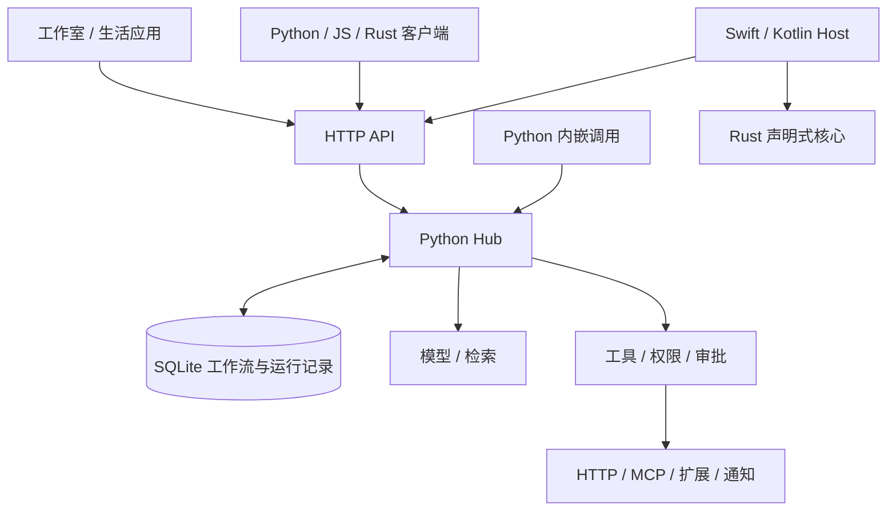

# EasyAgent 开发指南

**中文** · [English](DEVELOPER_GUIDE.en.md) · [项目首页](../README.md) · [使用指南](USER_GUIDE.zh-CN.md) · [文档索引](README.md)

版本基线：0.1.0 / 2026-09-20。面向 SDK 调用、节点与扩展开发、平台适配及框架维护。本文中的命令在仓库根目录执行。当前接口适用于开发预览；0.x 不承诺跨版本 ABI 稳定。

## 新手阅读顺序

先读[关键词搜索到生图](GETTING_STARTED.zh-CN.md)：以多输入、分叉与汇合的完整任务讲解。导出流程图不需要密钥；实际执行需要搜索和模型服务，不需要启动 App。再读[本地 SDK 与 CLI](SDK_GUIDE.zh-CN.md)，最后按需查阅本文。下面的完整开发环境面向修改框架和运行全套测试，并非使用 SDK 的前提。

先记住三层：**节点是一个独立操作**（内部可以组合普通代码）；**工作流连接多个节点**；**子工作流保留自己的步骤图和子运行记录**。`Module` 是组织代码和构图的容器，只有 `Subflow` 明确创建子工作流边界。

## 目录

- [开发环境](#开发环境)
- [代码地图与架构](#代码地图与架构)
- [执行与恢复语义](#执行与恢复语义)
- [工作流及接口契约](#工作流及接口契约)
- [Python、JavaScript 与 Rust](#pythonjavascript-与-rust)
- [接入模型、搜索与自定义-api](#接入模型搜索与自定义-api)
- [开发完整扩展](#开发完整扩展)
- [开发-skills-与-mcp-接入](#开发-skills-与-mcp-接入)
- [运行时开发、修复与学习](#运行时开发修复与学习)
- [开发应用与工作室界面](#开发应用与工作室界面)
- [权限、凭证与运维](#权限凭证与运维)
- [集成测试与调试](#集成测试与调试)
- [打包与跨平台](#打包与跨平台)
- [维护文档与提交变更](#维护文档与提交变更)

## 开发环境

需要 Python 3.11+（建议 3.12）、uv；完整开发/集成还需要 Node.js 20+、Rust/Cargo 和 Chromium。平台原生轮子不可用时需安装对应编译工具。仓库没有 Node 前端构建步骤。

```sh
uv sync --locked --extra app --extra dev --python 3.12
uv run --extra app playwright install chromium
uv run --extra app easyagent studio --port 8770 --database .eah/development.db
```

使用独立数据库与未占用端口。后续客户端可设置 `EAH_URL=http://127.0.0.1:8770`；CLI 提交、扩展安装和 Skill 命令使用各自的 `--url`。认证环境设置 `EAH_TOKEN`；不要把实际值提交到代码。

项目依赖在 [pyproject.toml](../pyproject.toml) 和 `uv.lock`；Rust 依赖在各 crate 的 Cargo.lock。SDK 尚不假定已发布到包仓库，按本仓库相对路径引用。

Python 服务端包名和命令均为 `easyagent`，独立客户端为 `easyagent-client`（导入 `easyagent_client`）；JavaScript 为 `@easyagent/client`，Rust 为 `easyagent-client` / `easyagent-core`。Python 运行器、本地 SDK 与模型目录位于 `src/easyagent/`；前端资源与独立代理位于 `apps/agent/src/easyagent_app/`，提供 `easyagent_app.*` 导入。后端提供 `easyagent.*` 导入，不安装旧包名、旧命令或导入转发钩子。

工作流、组件、扩展和备份格式统一使用 `easyagent.*.v1`；Rust 原生库为 `easyagent_core`，Android/iOS 应用标识为 `ai.easyagent.mobile`。旧命名的序列化包不再接受，已有包需离线迁移并重新计算摘要；签名包需要发布者重新签名，不能只修改格式字段后沿用旧签名。

桌面默认数据目录为 `EasyAgent`，不会查找或回退到其他产品目录。源码运行继续使用 `.eah` 数据目录和 `EAH_*` 配置变量；它们是配置约定，不提供其他 Python 包名的兼容入口。指定 `--database` 或 `EAH_DATA_DIR` 可选择自己的数据位置。工作区文件夹名称不决定 Python 导入名。

## 代码地图与架构

- `src/easyagent/contracts.py`：严格 Pydantic 公共契约、工作流图/Schema 校验；`store.py`：SQLite 事务与持久记录。
- `runtime.py`、`tools.py`：调度、执行、工具调用、审批及恢复；`goals.py`：目标检查和流程修订；`scheduling.py`：触发器。
- `models.py`、`model_streaming.py`：模型注册、协议与流式增量；`http_tools.py`、`openapi_tools.py`、`search.py`：声明式 API 与搜索。
- `extensions.py`、`extension_contracts.py`、`extension_process.py`：包、贡献、执行进程；`backends.py`：专用服务替换；`plugins.py`：旧进程插件。
- `skills.py`、`skill_packages.py`、`mcp_bridge.py`、`mcp_manager.py`：技巧资源与 MCP；`sessions.py`、`delegation.py`：会话与子 Agent。
- `development.py`、`code_development.py`、`evolution.py`、`learning.py`：运行时定义、代码候选、策略评估与经验。
- `connections.py`、`system_notifications.py`、`gateway.py`、`voice.py`：凭证、消息、通知及语音；`operations.py`：诊断/备份。
- `api.py`、`studio.py`：REST 与工作室 API；`apps/agent/`：独立浏览器 ES modules 与代理；`sdk/python/`、`sdk/javascript/`、`sdk/rust/`：独立三语言客户端。`client.py` 与 `extension_sdk.py` 将独立 SDK 的接口公开到 `easyagent` 包中。
- `core/`：可嵌入 Rust 状态机；`platforms/`：桌面、Swift/Kotlin Host；`examples/life_assistant/`：领域应用；`tests/integration/`：集成验收。



完整执行引擎位于 Python Hub；Rust SDK 是 HTTP 客户端，Rust core 是可嵌入执行子集。不要把三者误认为同一运行器，也不要在每种 SDK 中另写业务调度。

## 本地 SDK、CLI 与独立 App

[SDK 与命令行指南](SDK_GUIDE.zh-CN.md)包含可执行示例、退出码、审批恢复与三语言简写；[拆分设计](SDK_AND_APP.md)记录包边界。

`modules.py` 将 `@node` / `@tool`、`Agent`、`Module.forward`、`Sequential`、`Call`、`Subflow` 编译为现有 Workflow；`local.py` 管理同一个 Hub 的同步/异步生命周期。本地会话只领取本次调用和其子流程，服务模式负责整个工作区的定时调度、投递与维护。

`easyagent serve` 只提供后端 API。`easyagent-app --backend URL` 是独立浏览器应用与固定后端的同源代理；不会导入运行器。桌面和 `studio` 启动器显式组合这两个包。后端保留 `studio.py` 中的编排 API，不包含 HTML/CSS 资源。

基础安装不含 FastAPI、Uvicorn、MCP、浏览器、JS/WASM 引擎。对应能力选择 `server`、`mcp`、`code`、`browser`、`documents` extras，应用环境选择 `app`。隔离 wheel 验收：`python scripts/check_distributions.py dist`。

## 执行与恢复语义

提交时校验图、权限和能力，固定模型/工具/子流程/扩展等依赖快照，创建持久运行。Worker 以事务领取可执行步骤，并使用唯一 owner、租约、心跳和 fencing；失效 worker 不能回写新 owner 的结果。

`queued/running/waiting_approval/waiting_input/needs_attention/succeeded/failed/cancelled` 描述运行状态。内部步骤还可等待子运行、重试或跳过。SDK 的 `wait` 在最终状态或需要人工处理时返回，调用方必须检查 `status`。

工具 invocation 在副作用发生前落盘。成功调用可复用回执；确认支持幂等的调用才可恢复重试。没有回执的非幂等写操作进入核验，不承诺任意第三方系统的 exactly-once。审批绑定具体调用参数；重规划或参数改变不继承别的操作的批准。

`foreach` 与子流程创建持久子运行，等待时释放 worker；调用、token、子任务、时间和费用限制累计到根预算。取消向下传播，但不会撤销已发生的远端动作。补偿需要显式配置，不能把它当作数据库事务式回滚。

流程本身固定版本。在线修复创建新的子执行与流程版本，而不是在执行到一半时随意改写原 DAG。流程成功、目标验证成功、通知提交及外部送达是不同事实。

## 工作流及接口契约

### 最小工作流

以下定义无需模型、网络或凭证，可保存成 JSON 后用 `easyagent run` 提交：

```json
{
  "name": "hello",
  "inputs": {"message": "Hello"},
  "steps": [
    {"id": "echo", "target": "core.echo", "input": {"message": {"$ref": "$input.message"}}},
    {"id": "save", "kind": "artifact", "depends_on": ["echo"],
     "input": {"name": "hello.json", "media_type": "application/json", "content": {"$ref": "echo"}}}
  ]
}
```

`Workflow` 包含 `name/steps/inputs/metadata/limits`。步骤 ID 唯一；`depends_on` 必须存在且不能成环。`{"$ref":"step.path"}` 只引用已声明的祖先，`$input` 引用初始输入；Schema 中自己的 `$ref` 不作为数据连线处理。画布位置保存在 `metadata.editor`。

常用步骤类型：

- `tool`：调用注册工具；`target` 是名称，`input` 必须符合工具 Schema。
- `model`：调用模型别名及能力；`agent`：在 allowlist 内进行有界 `react` 或 `plan_execute`。
- `transform`：JSON 常量与引用重组，不执行任意脚本；`retrieve`：带来源检索；`artifact`：保存可下载结果。
- `foreach`：`input.items` + `body`，子流程使用 `$input.item`、`$input.index`；`subworkflow`：输入映射与固定流程引用。
- `approval` / `input`：显式确认或结构化补充信息；`goal`：目标控制入口，不应由普通修复器嵌套。

可配置 `max_attempts`、`timeout_seconds`、`not_before`、`requires_approval`、`when` 和 `compensate`。`workflow_ref={id,revision}` 引用保存版本；省略版本在准备时解析并固定，不在运行中追随最新。完整字段见[Workflow Schema](contracts/workflow.schema.json)。

### REST 与 Schema

运行实例的 `/openapi.json` 是端点/输入结构依据，`/docs` 可交互查看。核心入口：

- `POST /v1/runs` 提交；`GET /v1/runs/{id}` 状态；`POST /v1/runs/{id}/cancel` 取消。
- `GET /v1/runs/{id}/events?after=N` 增量事件；`/stream` 为 SSE，客户端保存游标以继续读取。
- `POST /v1/approvals/{id}` 提交 `{approved}`；`POST /v1/inputs/{id}` 提交符合问题 Schema 的对象。
- `POST /v1/reconciliations/{id}` 提交 `{output,receipt}`，用于核验未知写结果。
- `/v1/tools`、`/v1/models`、`/v1/skills` 提供目录；`/v1/studio/workflows` 管理保存定义。

提交可以携带 `Idempotency-Key`；同 key 不同定义会冲突。公开契约拒绝未知字段。错误有 `detail`；401/403 是认证/授权，404 是资源缺失，409 是版本/状态冲突，422 是输入校验。不要把所有错误统一当作可重试。

变更公共契约后执行：

```sh
uv run python scripts/export_contracts.py
```

它更新 `docs/contracts/*.schema.json` 与 `sdk/javascript/contracts.d.ts`；JS SDK 方法声明、Python 客户端和 Rust serde 类型仍需对应维护。生成 Schema 不能替代运行时跨字段、权限及外部业务校验。

## Python、JavaScript 与 Rust

调用已保存流程时，推荐 `client.workflow(id).start(inputs, key=...)` 和返回任务的 `result()`；JavaScript 使用 `{key}`，Rust 使用 `Some(key)`。`from_env` / `fromEnv` 读取 `EAH_URL`、`EAH_TOKEN`。`upload_file` / `uploadFile` 上传材料，`result.download(name, path)` 下载命名产物或视频地址。完整的[生图与视频三语言示例](../examples/getting_started/media/README.md)包含一次性配置、审批续跑和组合流程。

公共接口 `PUT/GET /v1/workflows/{id}` 管理定义，`POST /v1/workflows/{id}/runs` 接收 `WorkflowCall`（`inputs`、可选 `revision`）和 `Idempotency-Key`，`GET /v1/runs/{id}/result` 返回状态、`outputs`、包含子流程的产物、审批和错误。输入按 `metadata.input_schema` 校验；输出在 `metadata.outputs` 声明数据引用，可用 `metadata.output_schema` 校验。子流程输出同时保留原始 `results` 和稳定的命名 `outputs` 数组。

首次提交先持久化固定版本再运行。同一 Key、同一请求可跨进程或语言恢复，流程更新后也不重复生成；不同输入/版本复用 Key 会返回 409。`result()` 遇到审批、输入、核验、失败或取消时抛出携带任务 ID 和状态的 `RunStopped`，等待超时不会取消服务器任务。显式使用原 `approve`、`respond` 或工作室处理后，恢复同一任务。旧 `submit`/`wait` 和通用 `request` 接口保留。

### Python HTTP 与内嵌调用

完整可运行客户端：[python_client.py](../examples/getting_started/python_client.py)。使用 `async with HubClient(url, token)`，依次调用 `submit` 和 `wait`；对暂停运行调用 `approve`、`respond` 或通用 `request`，再等待同一 run ID。

独立客户端与插件 SDK 采用 Apache-2.0，源码位于 [sdk/python](../sdk/python/README.zh-CN.md)，导入方式为 `from easyagent_client import HubClient` 和 `from easyagent_client.extension_sdk import Extension`。根目录的 `uv sync` 会安装这个工作区成员；只需 SDK 时，可在仓库根目录执行：

```sh
python -m pip install ./sdk/python
```

这个包只依赖 `httpx`，不安装或导入服务端。服务端用户也可从 `easyagent.client`、`easyagent.extension_sdk` 访问同一个独立 SDK。嵌入 Python Hub 仍适用服务端 AGPL 许可，完整范围见[许可说明](LICENSING.zh-CN.md)。

内嵌例程：[embedded_tool.py](../examples/getting_started/embedded_tool.py)。

```sh
uv run python examples/getting_started/embedded_tool.py
```

它创建独立 Hub，注册带输入/输出 Schema 的异步 `math.add`，启动 worker，提交流程并校验结果为 `{"value":5}`，最后在 `finally` 中停止 Hub。处理器签名为 `async handler(arguments, context)`；`context.invocation_id` 可供外部服务去重。

I/O 使用异步实现；阻塞或不受信任业务放入合适的扩展运行环境。注册的 Python handler 必须在重启时重新注册；持久运行不意味着任意内存中的函数也会自动序列化。

### JavaScript / TypeScript

[JavaScript 客户端例程](../examples/getting_started/javascript_client.mjs)从仓库 `sdk/javascript/index.js` 导入 `HubClient`，无需 npm 安装。Node.js 20+ 提供其所需运行能力；声明来自 `index.d.ts` 和生成的 `contracts.d.ts`。

JS 方法包括 `submit/wait/approve/respond`、扩展/Skills/组件/工作流方法及通用 `request`。浏览器 UI 使用同源 fetch，不把 Hub token 发给模型或扩展 iframe。

### Rust

```sh
cargo run --locked --manifest-path sdk/rust/Cargo.toml --example demo
```

[demo.rs](../sdk/rust/examples/demo.rs)演示 `HubClient`、`serde_json::Value`、类型化 `Workflow`、补充信息暂停和恢复。`submit_typed` 保留子流程及固定工具版本；`submit` 与 `request` 可访问新端点。当前 crate 名称是 `easyagent-client`，在 Rust 代码中导入 `easyagent_client`。

用 Rust 编写工具进程参见 [plugin.rs](../sdk/rust/examples/plugin.rs)。该进程协议与 Rust SDK、手机 Rust core 是三个不同层次。

## 接入模型、搜索与自定义 API

### 配置与 Provider

复制并编辑[配置模板](../examples/getting_started/config.example.json)，替换基础地址和准确模型 ID，然后通过自己的环境注入 `MY_MODEL_KEY`：

```sh
uv run --extra app easyagent studio --port 8770 --database .eah/configured.db --config examples/getting_started/config.example.json
```

模板中的占位地址不能直接调用。不要把配置别名与同一数据库已持久连接的别名重复注册。模型支持 `chat/responses/anthropic` 方言，能力由 `capabilities` 声明；保底模型和计价字段需要部署者配置。

通用启动器不会看到 `OPENAI_API_KEY` 就自动创建连接。它读取 `--config` 中指定的凭证引用，或恢复设置中保存的连接。`OPENAI_BASE_URL/OPENAI_API_KEY/TYPESAFE_API_KEY/TINYFISH_API_KEY` 用于指定的 live demo；所需变量以 demo 的 `--help` 和源文件为准。

自定义 Provider 实现 `async generate(request: ModelRequest, model: str) -> ModelResult`，用 `hub.models.register(alias, provider, model_id, capabilities, ...)` 注册。返回 text/data/tool_calls/images/embeddings 和真实 usage。`decision` 是结构化决策能力，不强制某类模型身份。原生文本流由 `model_streaming.py` 处理；缺少结束标识的中断不能当作完整结果。

图像/音视频原生协议可用目录中的 HTTP 节点，不强制塞入统一文本方法。提交与状态查询分开；`Polling` 声明 pending/succeeded/failed、间隔、次数、截止时间。媒体产物引用仅在出站时展开，不在工作流内保存大段 base64。完整模型目录是协议快照，不是全模型在线成功清单。

### HTTPTool 与搜索

已有 HTTP 接口优先使用声明式 `HTTPTool`，通过 `POST /v1/studio/apis` 或 Python `register_http_tool` 注册。持久管理路径支持固定版本及 `expected_revision`；用户密钥使用凭证库别名或环境引用。

本地合成 API：

```sh
uv run --extra app python -m examples.demos.api_fixture
```

它在 8771 提供 `/lookup`，下面的定义可在“添加搜索 / API”导入或通过 API 保存：

```json
{
  "name": "demo.lookup",
  "description": "Look up synthetic local material",
  "method": "POST",
  "url": "http://127.0.0.1:8771/lookup",
  "effect": "read",
  "input_schema": {
    "type": "object", "properties": {"query": {"type": "string"}},
    "required": ["query"], "additionalProperties": false
  }
}
```

这是明确只读的本地 POST。真正的写 API 必须声明 `effect="write"`；默认不要承诺幂等。`idempotent=true` 只用于确实支持稳定 invocation 去重的操作。

参数可映射 path/query/header/cookie/body，整包 body 用 `body_parameter`；支持 JSON/form/multipart、JSON/text/artifact/media 响应。multipart 文件用 Hub 产物 ID，不读取任意宿主路径。远端要求 HTTPS；本机可 HTTP。普通响应上限 1 MB，媒体通道最多 10 MB；普通 HTTP 入站实际请求体上限 2 MB，只有原始 `/v1/artifacts/upload` 接口允许最多 50 MB。

OpenAPI 导入器仅处理支持的子集：常见参数、JSON/form、非递归本地引用与单种鉴权等；不宣称支持所有文档、multipart 或流式操作。复杂协议可手写 HTTP 定义、使用原生目录、MCP 或扩展。

TinyFish 有专用校验与设置端点：`GET/POST /v1/studio/search/tinyfish`，测试为 `POST /v1/studio/search/tinyfish/test`。API Key 加密保存，设置优先于同名启动配置。Python 可用 `register_tinyfish`；无需供应商 SDK。

### 通知与服务后端

保存 `Connector` 后获得 `connection.<id>` 工具，调用先审批再入持久 outbox。配置快照固定；HTTP 渠道与浏览器系统通知分别处理，工作流成功仅表示入队。

系统通知使用 `kind="system"` 和 32 位十六进制 `device_id`，无需 URL/凭证；工具输入 `{text,title?}`。`/v1/connections/system/claim` 原子领取，`/v1/connections/system/{delivery_id}/receipt` 用 claim token 回报 `submitted/failed`。35 秒无回执标为 `uncertain`，不重放。`submitted` 的 `display_confirmed/read_confirmed` 均为 false。接收端必须有权限并保持页面打开。

扩展后端可替换 memory/context/terminal/browser/approval/channel/media 的规定操作。`/v1/backends/{kind}` 固定扩展与版本，运行快照继承该绑定；替换后端不会自动迁移历史业务数据。内置浏览器/终端默认关闭，配置授权后才可发现。

## 开发完整扩展

### 最小项目

首次使用空目录执行；已有同名目录时请换目录，不覆盖代码：

```sh
uv run easyagent extension init .eah/tutorial-extension --id tutorial_echo --language javascript
uv run easyagent extension package .eah/tutorial-extension --output .eah/tutorial-extension.json
uv run easyagent extension install .eah/tutorial-extension.json --url http://127.0.0.1:8770
```

脚手架包含 `manifest.json`、`sources.json` 和 `extension.js`。纯 JavaScript 默认使用 QuickJS，没有 Node、网络、文件、环境变量访问。测试流程：

```json
{"name":"extension demo","steps":[{"id":"echo","target":"tutorial_echo.echo","input":{"message":"hello"}}]}
```

修改 manifest 的 revision 后重新打包安装，不能替换同一 ID/revision 的不同源码。`sources.json` 明确打包哪些文件；构建会计算 lock/digest。发布前补全工具描述、输入/输出 Schema 和效果声明，让表单、画布和自动构建都能正确使用。

### 运行环境与协议

`--language` 支持 `javascript/python/node/rust`；WASM 按扩展契约打包。完整 Python/Node/Rust 进程需 `trusted_process` 授权和安装预览返回的精确 `trust_digest`。Rust 使用锁定依赖并离线构建；预先准备依赖，不依靠安装器自动下载任意包。

请求形状为 `{protocol_version:1,id,method,params,context}`，stdout 响应 `{result}`、`{error:{code,message,retryable}}`，或 `{calls,continue}` 服务 continuation；日志仅写 stderr。一次进程或 NDJSON 常驻模式使用同一契约，超时/取消会终止进程树。

纯 JS 的入口是同步 `handle(request)`，返回响应对象。Python/JS 扩展 SDK 和 Rust `serve_extension` 可辅助进程协议。旧插件的字符串版本协议仍独立兼容，不能混用其 manifest 或响应格式。

### 可以贡献什么

- tools/services/commands：工具 Schema、处理器、读写与幂等定义；命令返回持久 run ID。
- providers：模型能力、处理器及可选 stream/cancel handler；扩展流使用 cursor/deltas/done 的分页协议。
- hooks：工作流、Agent、turn、model、tool、message、session、资源发现及 custom 事件。只允许规定的参数/结果/上下文 patch，修改后重新校验，不能扩张权限。
- settings/flags/state：Schema 驱动表单与 CAS revision 状态；迁移先校验再激活。旧运行保留旧代际，回滚不等于撤销外部动作。
- views/skills/prompts：沙箱 iframe、技巧与提示模板。iframe 不获得 Hub token；只能发起声明允许的命令或编辑草稿。
- dependencies/required_services/service_versions：固定依赖与服务权限。普通工具服务调用须显式授权；依赖中的写操作仍要审批。
- backends：规定的记忆、上下文、浏览器、终端、审批展示、渠道和媒体操作。

生命周期包括 activate/dispose；候选验证或迁移不能擅自提交状态/调用业务服务。安装、激活、停用、卸载检查依赖和历史引用。可选 Ed25519 签名验证发布者身份，不自动赋予本机执行信任。

包与请求 Schema 见 [extension-manifest](contracts/extension-manifest.schema.json)、[extension-package](contracts/extension-package.schema.json)、[extension-request](contracts/extension-request.schema.json) 和 [extension-response](contracts/extension-response.schema.json)。高级事件与会话接口见[扩展规范](EXTENSIONS.md)。该扩展系统不直接加载 Pi TypeScript 包、TUI 或 npm 插件接口。

## 开发 Skills 与 MCP 接入

### Skill 结构

最小 `SKILL.md`：

```markdown
---
name: source-checklist
description: Turn supplied material into an action list with source evidence.
---
For each action, record its owner, deadline and source.
Mark missing facts as unknown. Do not claim an external action was completed without a receipt.
```

可加入 `references/` 文本资源。支持最多 80 个文件、单文件 128 KB、总计 1.5 MB；拒绝路径穿越、绝对路径及符号链接。包包含 `schema_version/files/source`；远程来源解析到固定提交再预览。

```sh
uv run easyagent skill package examples/skills/careful-planner --output .eah/careful-planner.json
uv run easyagent skill install .eah/careful-planner.json --url http://127.0.0.1:8770
uv run easyagent skill list --url http://127.0.0.1:8770
```

新安装使用 expected revision 0；更新应指定当前版本。Agent 的 `skills` 提前加载正文，或 `skill_access` 配合 `skills.read` 按需读取冻结资源。安装脚本不自动执行，`allowed-tools` 不是权限授予。停用/回滚不修改旧运行快照；分享包含 Skill 文本时需检查其内容。

### MCP

客户端使用官方 MCP SDK，支持 stdio 与 Streamable HTTP、连接生命周期、发现刷新、OAuth 和重连。每个远端工具的本地 effect/idempotent 由操作者声明，不接受远端文档提升权限。stdio 命令和 `env_allow` 属部署配置；HTTP OAuth 凭证加密保存。

启动 `uv run easyagent mcp --url http://127.0.0.1:8770` 会以 stdio 向 MCP 客户端暴露 Hub，由 MCP 客户端管理该进程。不要在它的 stdout 输出调试日志。端点清单与 SDK 的真实集成用例见 `tests/integration/test_managed_mcp.py` 和 `test_interop.py`。

## 运行时开发、修复与学习

Agent 的 `development` 授权限定可写命名空间、域名、凭证引用及可读/执行的工作流。它可读取文档、创建/更新声明式 API 与流程并保存版本；不能修改自己的授权。复用其他命名空间只开放明确授予的组件版本及其传递能力。

新算法使用 `code.create → code.test → code.publish`：生成纯 JS/WASM 候选，实际运行场景，评估通过且经过批准后发布固定工具。完整 Python/Node/Rust 插件仍通过操作者的受信任安装路径。模型生成的测试不能代替独立业务验收。

目标控制通过 `POST /v1/goals` 接收 `GoalSpec`：objective、workflow、model、checks、semantic_check、max_revisions、allowed_tools/models、allow_code 与 limits。每条 check 的 path 从步骤输出开始，例如 `answer.difference` 搭配 `{"const":50}`。确定性检查先于可选语义判定；修复模型不能改目标、预算或授权，最多 12 次修订。

`POST /v1/goals/{id}/control` 支持 pause/resume/feedback。暂停阻止后续续跑，已开始的步骤可完成；取消不能恢复或撤销远端操作。变更写操作、嵌套写入或未知结果需核验，不能以“自动修复”为由重复执行。

经验与策略改进是“候选 → 可执行评估 → 人工发布 → 可回滚版本”；自动复盘默认关闭。它不训练模型权重。持续会话保存消息树、来源摘要和事件；动态子 Agent 使用父级授予的工具/模型和共享预算，不是无限自治 swarm。

## 开发应用与工作室界面

领域应用参考 [life_assistant/app.py](../examples/life_assistant/app.py)：建立业务表与 API，注册领域工具，提交工作流；不要把生活事务字段塞进通用调度器。`create_app(hub)` 提供 API，`install_studio(app, hub)` 添加 Studio，应用使用自己的挂载入口。

前端是原生 HTML/CSS/ES modules，无 npm 打包环节。Schema 驱动工具、扩展设置和命令表单；复杂 JSON 仅放高级入口。新能力应同时可被 API/SDK、画布和零代码构建发现，避免复制三个互不一致的实现。

对话办事由 `workspace_chat.py`、`attachments.py` 和 `apps/agent/src/easyagent_app/static/workspace-chat.js` 实现，复用会话、版本化工作流、运行器和产物。`POST /v1/conversations` 传 `workspace: true` 创建办事会话，模型默认 `auto`；`POST /v1/conversations/{id}/messages` 使用 `ConversationInput` 的 `text`、`attachments`（artifact ID 数组）、`intent`（auto/create/workflow/chat）、`workflow`（id@revision）和 `idempotency_key`。先把原始文件上传至 `/v1/artifacts/upload?name=...`，再发送 ID；勿把 base64 内嵌到持久化流程。

`GET /v1/conversations/workflow-catalog` 提供流程用途、固定版本和业务输入 Schema；可设置工作流 `metadata.chat_enabled=false` 排除自动匹配。优先声明 `metadata.input_schema`，否则按 `$input` 引用推导字段。`DispatchDecision` 匹配结果不能改流程或授权，置信度低于 0.82 先澄清；输入在执行前按 Schema 校验。目录最多自动比较 100 项，完整路由上下文最多 180000 字符，超限需指定流程或拆分材料。

`conversation_jobs` 保存路由、编排及执行阶段，先持久化快照再幂等提交，取消使用状态比较避免晚到的结果覆盖。调度按活跃任务扫描，不受 200 条历史列表分页限制。前端每 800 ms 读取实际运行状态，使用真实依赖关系画图，复用 `renderRun` 处理审批、输入和核验；不会重绘用户正在填写的表单。`chat-format.js` 只渲染转义后的有限 Markdown，禁止原始 HTML 和远程资源。

`ModelRequest.attachments` 在 provider 边界展开为模型内容块：图片支持 Chat/Responses/Messages；文本/PDF/DOCX 提取文字；WAV/MP3 支持 Chat `input_audio`。直接视频输入要求 Chat 协议且 binding 显式声明 `video_input` 能力，其他视频使用媒体处理工具。模型仍需实际支持相应输入。上传上限不等于处理上限，直接模型附件总计最多 12 MB。新增字段通过契约导出脚本同步 JSON Schema 和 TypeScript 类型，集成场景见 `test_workspace_chat.py` 与 `test_workspace_chat_browser.py`。

公开静态页不能包含凭证；动态数据使用统一 `api` 封装与当前令牌。用户/工具文本需转义；产物预览走认证下载通道。刷新列表不要清空正在填写的表单，异步结果不可覆盖已关闭/切换的视图。任务结果在本条记录下展开。

当前 UI 主要为中文。新增用户术语使用直观名称，并在英文指南保留可定位的中文标签。桌面和窄屏都检查操作路径，不只检查静态截图。

## 权限、凭证与运维

默认绑定 loopback；非本机地址要求 `EAH_TOKEN`。HTTP 边界检查同源与实际请求体大小。远程使用 HTTPS；不要通过开放任意 CORS 绕过边界。单个操作者令牌不提供多租户隔离。

Fernet 凭证密文在 SQLite，解密密钥是相邻 `.secrets.key`，权限 0600。能读取两者的同一账户仍可解密；不能声称是硬件密钥托管。API/日志/导出使用别名，具体出站请求由服务端解密。Prompt 和 Skill 中直接写入的秘密不会因使用凭证库而自动消失。

受信任进程不构成沙箱；QuickJS/WASM 的纯计算边界与完整进程权限必须明确。网络/文件动作优先通过已配置工具服务，而不是给模型任意宿主命令能力。内置终端的工作目录限制不是文件系统隔离。

数据库放本地可靠磁盘，使用 WAL、短事务和 SQLite backup；不支持网络文件系统多主。`easyagent doctor` 检查诊断，`/v1/operations/metrics` 输出 Prometheus，`/v1/operations/traces/{run_id}` 提供追踪。备份包含 DB/解密密钥并整体密码加密，恢复只允许新路径；外部源码、环境和工具链另行部署。

费用限制需要可信价格与 usage；未知计费不能当作零成本。搜索、媒体等第三方工具成本不能仅靠 LLM cost_usd 表示，应同时设置调用次数、时间预算和供应商配额。

## 集成测试与调试

本项目只维护集成测试。新增测试应跨真实 SQLite、HTTP、进程、工作流或 UI 验证行为，不写与实现逐行对应的单元测试。

```sh
uv run --extra app --extra dev pytest -q tests/integration
uv run --extra app python -m examples.demos.run_all
uv run --extra app python -m examples.demos.advanced
uv run --extra app python -m examples.demos.scenarios
uv run --extra app --extra dev ruff check src sdk/python/src tests examples
cargo clippy --locked --manifest-path sdk/rust/Cargo.toml --all-targets -- -D warnings
```

修改前端后对相应文件执行 `node --check 文件路径`，再实际浏览器操作。浏览器测试先安装 Chromium；Linux 环境可能另需系统依赖。完整 Chromium 的通知能力与 headless shell 不完全相同，系统通知验收需区分通知 API 接受和可见 OS 横幅。

按改动选择场景：

- 工作流/可靠性：`test_runtime.py`、`test_recovery_and_limits.py`、`test_complete_workflows.py`。
- API/模型/媒体：`test_search_and_apis.py`、`test_model_protocols.py`、`test_multimedia_demo.py`。
- 插件/扩展/Skills：`test_interop.py`、`test_extensions.py`、`test_skill_packages.py`、`test_backends.py`。
- 修复/会话/通知：`test_goals.py`、`test_conversations.py`、`test_system_notifications.py`。
- 分享与领域应用：`test_workflow_packages.py`、`test_component_packages.py`、`test_life_assistant.py`。

使用临时目录、未占用端口和合成凭证，避免覆盖已有连接或数据库。只读计算、回显与本地协议 fixture 适合默认验证；付费生成或真实外发应明确区分。对外部未知写结果的测试必须覆盖拒绝自动重试。

最近框架全套为 128 passed（2026-09-20）。本地协议通过不证明真实模型质量；CI 配置不等于 CI 成功。真实图片与参考图动画已成功；内联图片 503、上传地址适配和音频参数差异记录于 [MEDIA_ACCEPTANCE.md](MEDIA_ACCEPTANCE.md)。72 小时测试入口为 `uv run python scripts/soak.py --seconds 259200`，尚未完成该时长的验收。

## 打包与跨平台

Python 分发：

```sh
uv build --all-packages
```

该命令构建 `easyagent` 本地 SDK/可选服务端、`easyagent-client` HTTP SDK、`easyagent-app` 前端三个 wheel。运行器依赖客户端；前端不依赖运行器。前端静态资源仅在 App wheel，框架 wheel 包含运行器与 examples 的后端代码。每个发行包携带许可文本，`output/` 和 `.eah/` 不进入归档；外部模型、账号、浏览器二进制和全部开发文档不等于随 wheel 提供。检查包内容并在隔离环境验证启动，不只看构建成功。

桌面在目标系统本机打包：

```sh
uv run --extra desktop python platforms/desktop/build.py
```

输出位于 `.eah/build/desktop/`。包包含 Python 与纯计算运行依赖；Playwright 浏览器需另行准备。源码启动默认 `.eah/hub.db`；桌面启动器使用操作系统应用数据目录，或 `EAH_DATA_DIR` 覆盖。不要误把两个数据目录当作自动同步。

移动构建：

```sh
platforms/ios/build.sh
platforms/android/build.sh
```

iOS 脚本需要 macOS、Xcode/模拟器 SDK、Rust，当前构建 Apple Silicon 模拟器包；Android 需要 JDK 17、Gradle 8.9、SDK 35、NDK、cargo-ndk 与 `ANDROID_NDK_HOME`。两条命令只在对应工具链具备时执行。

Rust core 通过 C ABI/JNI 交换 JSON，Host 提供平台能力，Python Hub 提供完整远端执行。不引入 Docker，不假定 iOS 可运行下载的任意 Python/Node 二进制。手机 native 通知、配对密钥管理、后台策略、自动跨设备接力与正式商店发行仍独立待完成。

[集成 CI](../.github/workflows/integration.yml) 与[发行构建](../.github/workflows/releases.yml)定义目标矩阵，实际运行结果需另行查看。当前已完成 macOS 本机包和 iOS 模拟器离线流程；Android APK、Windows/Linux 实机、手机后台及正式签名公证不能写成已通过。

## 维护文档与提交变更

1. 先定义用户场景、输入/输出 Schema、权限、副作用、版本和失败语义。
2. 实现共享后端，再接 SDK、画布表单和自然语言能力目录。
3. 添加有意义的集成场景，更新生成契约；验证历史定义和固定版本仍可执行。
4. 同步修改中文与英文 README、使用指南、开发指南相关段落；专题文档补充细节，验收文档保留日期和证据类型。
5. 检查相对链接、目录锚点、命令参数及示例输出；真实密钥、数据库、构建缓存不提交。

贡献按所属组件的许可证提交；移动代码时同步维护[许可范围](LICENSING.zh-CN.md)、包元数据和声明。已知缺口和路线见 [NEXT_DELIVERY.md](NEXT_DELIVERY.md)、[移动端策略](MOBILE_RUNTIME_STRATEGY.md) 和[差距分析](PI_HERMES_GAP_ANALYSIS.md)；旧阶段记录不能覆盖更新的实际实现。
