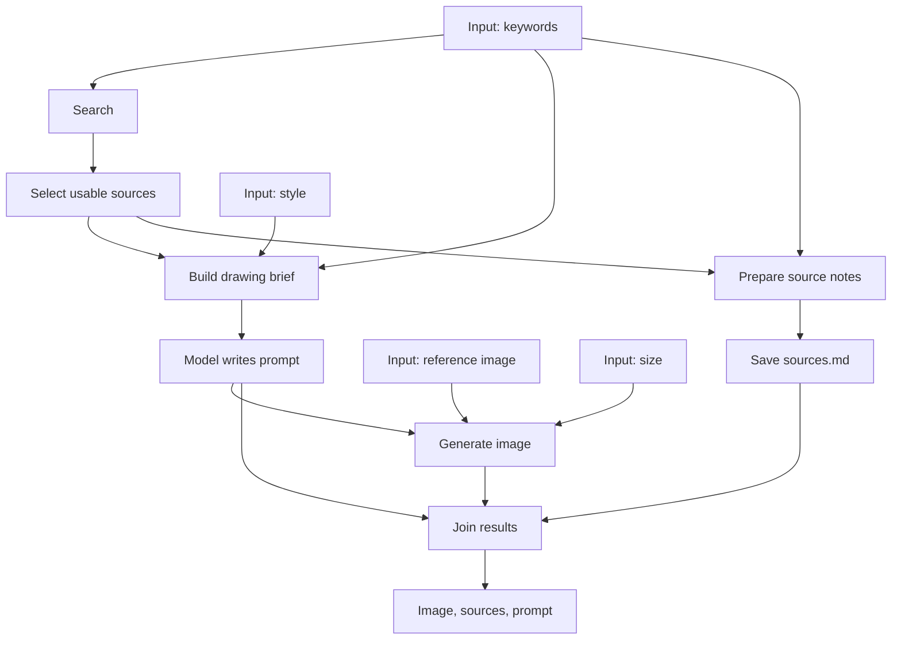

# From keyword research to a generated image

[简体中文](GETTING_STARTED.zh-CN.md) | **English** · [SDK reference](SDK_GUIDE.en.md)

Extend the project's reference-image generation example with research. Supply character keywords, your reference image and a requested style; receive an image, the actual source notes and the image prompt.

[Executable source](../examples/getting_started/media/research_image.py) · [Provider configuration](../examples/getting_started/media/research_image.config.example.json) · [Previous live media acceptance](MEDIA_ACCEPTANCE.md)

This image is the project's **previously generated live result**, illustrating the deliverable. This change connects research and source notes into reusable code; it did not regenerate this image.


## 1. Read the workflow



Sources split into two branches. Notes can be saved while the model writes a prompt. The final node waits for both the image and the notes.

## 2. Parameters express inputs; variables express connections

This is the central part of the example. The complete file also defines the provider bindings and helper nodes:

```python
class ResearchImage(Module):
    # See the complete source for __init__ and node definitions.
    def forward(self, keywords: str, reference_image: str,
                style: str = 'Q版，开心挥手，纯色背景', size: str = '1024x1024'):
        found = self.search({'query': keywords})
        sources = evidence(found)

        prompt = self.writer(drawing_brief(sources, keywords, style))
        image = self.draw(prompt, reference_image, size)

        notes = self.save_sources(source_notes(sources, keywords))
        return deliver(image, notes, prompt)
```

- `drawing_brief` takes sources, keywords and style: three inputs.
- `draw` combines an upstream prompt with the separate reference-image and size inputs.
- Both branches consume `sources`.
- `deliver` waits for all its upstream results.
- The result contains multiple outputs: `image`, `sources` and `prompt`.

**Dependencies follow data references, not source-code line order.** Notes do not depend on the image, even though their line comes later. Establish a real dependency when one side effect must wait for another.

`Sequential(a, b, c)` is a convenience for passing one result along a chain. Use `Module.forward` for multiple inputs, parallel branches and joins.

## 3. Identify the nodes

`evidence` is one node: it filters unusable sources, deduplicates, keeps five snippets and rejects an empty search. Multiple ordinary Python operations still form one input/output boundary.

`ImageEdit` provides readable arguments for the existing image API; it expands to one API step, not a subworkflow. `ResearchImage` is an eight-step workflow. To retain those eight steps as a separate child run when composing another workflow:

```python
from easyagent import Subflow
from examples.getting_started.media.research_image import ResearchImage

research_image = Subflow(ResearchImage())
```

## 4. Configure providers and run from a terminal

From the repository root:

```sh
uv sync --locked
cp examples/getting_started/media/research_image.config.example.json research-image.config.json
```

Edit the text provider's `models[0].base_url` and `models[0].model`, and the image service's `http_tools[0].url`. The example uses the existing multipart `/v1/images/edits` protocol.

Set `TINYFISH_API_KEY` and `OPENAI_API_KEY` in your environment. The configuration references names rather than embedding secrets. The image model defaults to the previous example's `gpt-image-2.5-flare`; override it with `--image-model`. Use model names, sizes and parameters supported by your provider.

```sh
uv run python examples/getting_started/media/research_image.py \
  --config research-image.config.json \
  --keywords 'Aventurine character appearance clothing official references' \
  --reference examples/assets/character-reference.jpg \
  --style 'Chibi, cheerful wave, preserve the reference clothing, plain background' \
  --key aventurine-image-01
```

This uses the public character reference included in the repository with metadata removed; replace the path to use your own image. The user-provided style attachment and combined reference board from the earlier acceptance run remain local and are not distributed. The script uploads it to the local runtime, searches, calls the text model, then pauses before image generation with `waiting_approval`. Inspect the returned approval and resume the same run:

```sh
uv run easyagent approve INVOCATION_ID --yes --database .eah/research-image.db
uv run python examples/getting_started/media/research_image.py \
  --config research-image.config.json --resume RUN_ID
```

Use `approvals[0].id` for `INVOCATION_ID` and the returned run `id` for `RUN_ID`. Completed search and model steps are reused. New inputs mean a new operation/key; timeouts or approvals should resume the existing run.

Files are saved under `output/research-image/`: `image.png` (extension follows the media type), `sources.md`, `prompt.txt` and `result.json`. Source notes contain actual search snippets and URLs, not independently verified full-page claims.

The media adapter stores base64 or binary image responses as artifacts. URL-only responses require a download step. To inspect the graph without credentials or network requests:

```sh
uv run python examples/getting_started/media/research_image.py --export research-image.workflow.json
```

Exported JSON contains the graph, not Python function source. Other environments still need the example code and dependencies; distribute code through extension packages.

## 5. Call the same workflow from Python

```python
from easyagent import Runtime
from examples.getting_started.media.research_image import ResearchImage

with Runtime('.eah/research-image.db', config='research-image.config.json') as runtime:
    reference = runtime.upload('examples/assets/character-reference.jpg')
    result = runtime.run(
        ResearchImage(),
        keywords='Aventurine character appearance clothing official references',
        reference_image=reference['id'],
        style='Chibi, cheerful wave',
    )
    print(result.value['image'], result.value['sources'])
```

Approval raises `RunStopped`; the complete script handles it and prints recovery details. No HTTP server or App is needed for local execution.

## 6. Conditional routing is different from parallel branches

Both branches above execute. “Generate only when research succeeds; otherwise request more information” is conditional routing. This example rejects an empty search inside `evidence`, so it never calls the text or image models without usable sources.

`forward()` constructs a graph. Python `if sources:` cannot inspect an unexecuted result and fails explicitly. Durable conditional paths currently use the lower-level `Step.when` / `Workflow` contract. Native Python dynamic branching and automatic merging of mutually exclusive branch results are not implemented in the shorthand API.

Tests cover multiple inputs, actual concurrent branches, join waiting, empty search, approval and restart, and Python/CLI execution over real local HTTP. These tests use fixture responses; they do not represent a new live image-generation run. Previous live media evidence is linked above.
