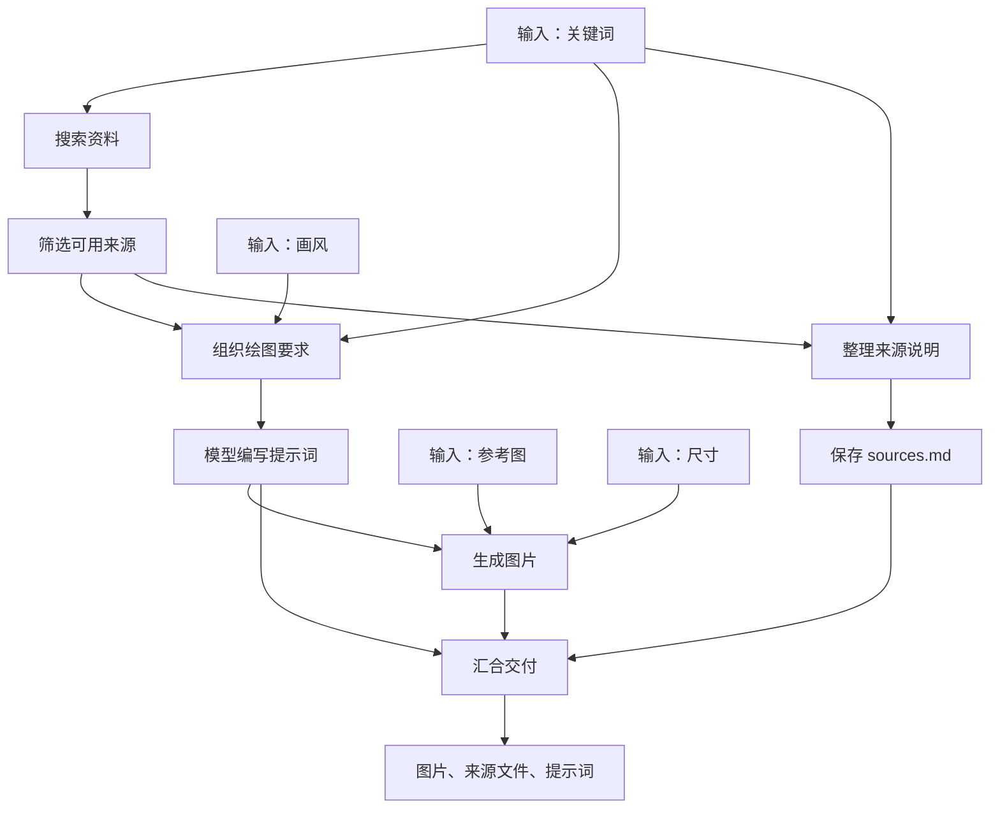

# 从关键词搜索到生成图片

**简体中文** | [English](GETTING_STARTED.en.md) · [SDK 参考](SDK_GUIDE.zh-CN.md)

以项目之前的“参考图生成角色表情”为案例，再往前接上资料搜索：输入“砂金 角色 外观 服装”等关键词、一张自己的参考图和“Q 版开心挥手”的画风，得到生成图片、实际使用的来源说明和绘图提示词。

[完整可执行源码](../examples/getting_started/media/research_image.py) · [服务配置示例](../examples/getting_started/media/research_image.config.example.json) · [之前的生图与视频记录](MEDIA_ACCEPTANCE.md)

下面是这个项目**此前真实生图调用**保存的结果，用来说明这个案例的交付物；本轮将搜索与来源分支接成可复用代码，没有重新收费生成这张图。


## 1. 先看这个流程在做什么

这不是一条只能从左到右串起来的链。搜索得到的资料会分成两路，图片生成还需要另外两个输入：参考图和画风。



例如模型正在写提示词时，另一条分支就可以把来源文件保存好。最后的“汇合交付”必须等图片和来源文件都准备好。

## 2. 用普通参数表达多输入，用变量表达连线

源码中的核心就是下面这段。`self.search`、`self.writer`、`self.draw` 分别连接搜索、文字模型和生图接口；其定义与辅助函数都在同一份示例文件里。

```python
class ResearchImage(Module):
    # __init__ 中配置各节点，见完整源码。
    def forward(self, keywords: str, reference_image: str,
                style: str = 'Q版，开心挥手，纯色背景', size: str = '1024x1024'):
        found = self.search({'query': keywords})
        sources = evidence(found)

        prompt = self.writer(drawing_brief(sources, keywords, style))
        image = self.draw(prompt, reference_image, size)

        notes = self.save_sources(source_notes(sources, keywords))
        return deliver(image, notes, prompt)
```

读这段代码，只需要跟着变量看：

- `drawing_brief(sources, keywords, style)` 有三个输入：资料、关键词、画风。
- `self.draw(prompt, reference_image, size)` 同时使用上游提示词和流程的参考图、尺寸输入。
- `sources` 被两条分支使用，一份数据可以连接多个节点。
- `deliver(image, notes, prompt)` 有多个上游，等待它们都成功后再执行。
- 返回的是包含 `image`、`sources`、`prompt` 的字典，一次工作流可以交付多个结果。

**依赖由变量引用决定，不由代码上下行决定。** `notes` 虽然写在 `image` 后面，但它没有使用 `image`，因此不会等待生图。不要通过交换代码行来安排副作用顺序，必须建立明确依赖。

`Sequential(a, b, c)` 只是“一份结果依次传下去”的快捷写法。多输入、并行分叉、汇合直接用 `Module.forward`，无需把整个项目改成线性链。

## 3. 在这个案例里，什么是节点

`evidence` 是一个节点：内部筛掉没有来源链接的结果、去重、截取前五条，并在没有有效资料时停止。虽然包含多个普通 Python 操作，对外仍然只有一次输入和一次输出。

`ImageEdit` 给生图 API 起了容易理解的参数名，它展开后仍然只有一个 API 节点；它不是子工作流。

整个 `ResearchImage` 是八步工作流。如果另一个流程希望把这八步整体当作一个可复用流程调用，可以显式写：

```python
from easyagent import Subflow
from examples.getting_started.media.research_image import ResearchImage

research_image = Subflow(ResearchImage())
```

这才会保留单独的子运行记录；内部搜索、写提示词、生图和保存来源仍各有自己的状态。

## 4. 配置一次，然后从命令行运行

在仓库根目录安装，并复制示例配置：

```sh
uv sync --locked
cp examples/getting_started/media/research_image.config.example.json research-image.config.json
```

编辑复制的文件，只需按自己的服务修改这些位置：

1. `models[0].base_url`：文字模型的兼容服务地址。
2. `models[0].model`：该服务实际提供的文字模型名称。
3. `http_tools[0].url`：参考图生图接口地址，示例使用 `/v1/images/edits`。

终端环境需要有 `TINYFISH_API_KEY` 和 `OPENAI_API_KEY`。配置文件只引用变量名。搜索与模型可以使用不同服务；生图模型默认沿用之前示例的 `gpt-image-2.5-flare`，可通过 `--image-model` 修改。模型名称、尺寸和接口参数以自己的供应商为准。

执行实际工作流：

```sh
uv run python examples/getting_started/media/research_image.py \
  --config research-image.config.json \
  --keywords '砂金 角色 外观 服装 官方资料' \
  --reference examples/assets/character-reference.jpg \
  --style 'Q版，开心挥手，保留参考图中的服装特征，纯色背景' \
  --key aventurine-image-01
```

命令使用仓库中去除元数据的公开角色参考图，也可以把该路径替换成自己的图片。此前验收使用的用户画风附件和组合参考板仅保留在本地，不随仓库分发。脚本会上传参考图到本地运行器，然后开始联网搜索和调用文字模型。到生图前会按框架规则暂停，返回 `waiting_approval`、运行 `id` 和 `approvals`。

查看并批准这一次生图调用，然后恢复原运行：

```sh
uv run easyagent approve INVOCATION_ID --yes --database .eah/research-image.db
uv run python examples/getting_started/media/research_image.py \
  --config research-image.config.json --resume RUN_ID
```

`INVOCATION_ID` 取自 `approvals[0].id`，`RUN_ID` 取自返回的运行 `id`。恢复会复用已完成的搜索和提示词，不重新创建任务。修改关键词或图片代表新操作，应使用新 key；超时或等待审批时继续恢复原运行。

完成后查看 `output/research-image/`：生成图 `image.png`（扩展名跟随实际格式）、`sources.md`、`prompt.txt` 和 `result.json`。来源文件记录搜索接口返回的摘要与链接，不表示已读取或核实网页全文。

示例沿用已有的媒体适配器，支持将 base64 或二进制图片保存为产物；如果供应商只返回下载 URL，需要配置下载步骤。只想看图结构、不调用服务时：

```sh
uv run python examples/getting_started/media/research_image.py --export research-image.workflow.json
```

JSON 只保存流程图，不包含 Python 函数源码；在其他环境执行仍需原示例及依赖，分发代码可以使用扩展包。

## 5. 同一个流程如何在 Python 中使用

```python
from easyagent import Runtime
from examples.getting_started.media.research_image import ResearchImage

with Runtime('.eah/research-image.db', config='research-image.config.json') as runtime:
    reference = runtime.upload('examples/assets/character-reference.jpg')
    result = runtime.run(
        ResearchImage(),
        keywords='砂金 角色 外观 服装 官方资料',
        reference_image=reference['id'],
        style='Q版，开心挥手',
    )
    print(result.value['image'], result.value['sources'])
```

等待审批时会抛出 `RunStopped`，完整脚本已处理并打印恢复所需的信息。上述调用不需要先启动 HTTP 服务或 App；脚本和 CLI 共用本地运行器。

## 6. “分叉”还有一种：按条件只走一路

上面的两路都会执行，是并行分叉。如果需求是“有搜索结果才生图，否则要求用户补充关键词”，这是条件分支。当前案例在 `evidence` 节点里检查；没有有效来源就明确失败，后面的模型与生图不会调用。

`forward()` 是构图函数，不能对还没有执行的结果直接写 `if sources:`。SDK 会明确报错。要保留可恢复的条件路径，当前使用底层 `Step.when` / `Workflow`；Python 原生动态 `if`、自动合并互斥分支结果，当前简写层尚未提供。不能把并行分叉和条件路由混为一谈。

已经测试：多输入连接、两路实际并行、汇合等待、来源为空时停止、审批后重启恢复，以及 Python/CLI 的同一条真实协议链。本轮自动测试使用本地 HTTP 服务模拟搜索和模型响应，**没有把测试图片冒充新的真实模型生成结果**。之前的真实模型产物与验收范围见[媒体记录](MEDIA_ACCEPTANCE.md)。
